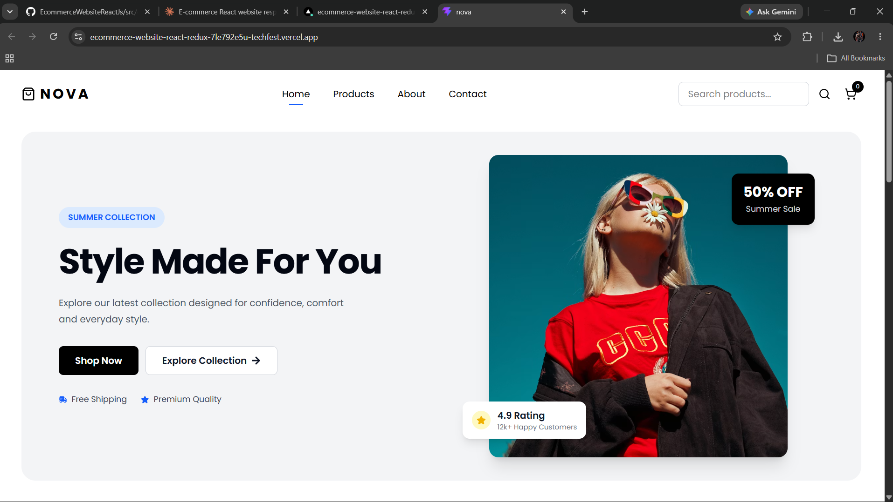
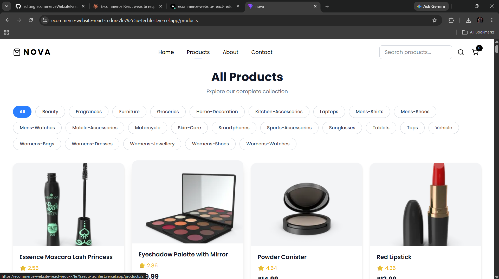
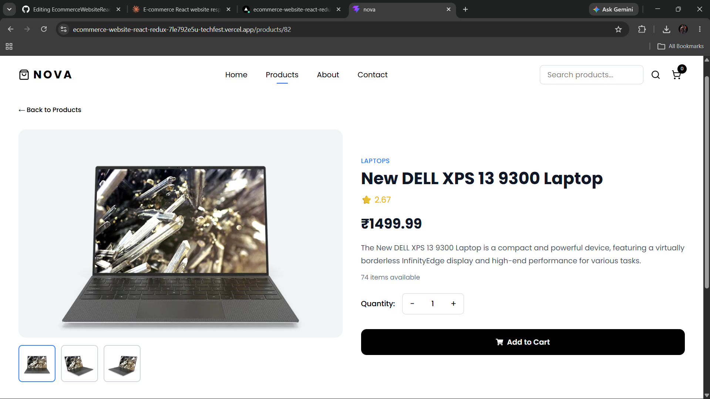
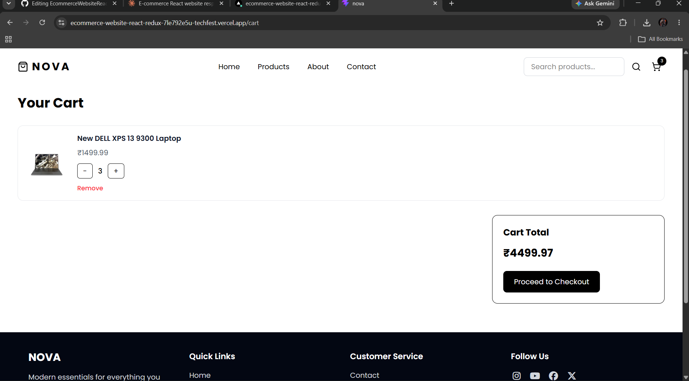
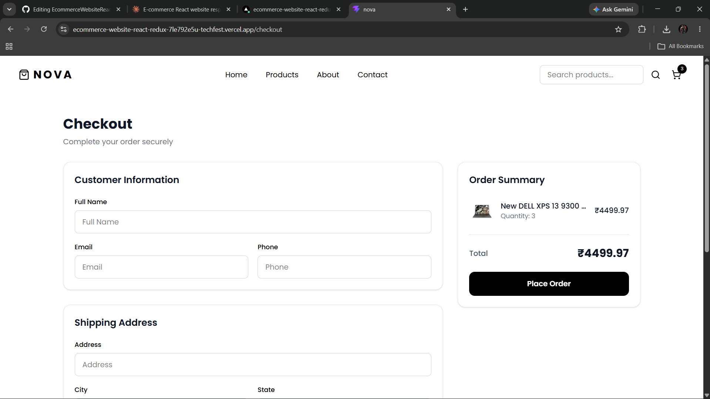
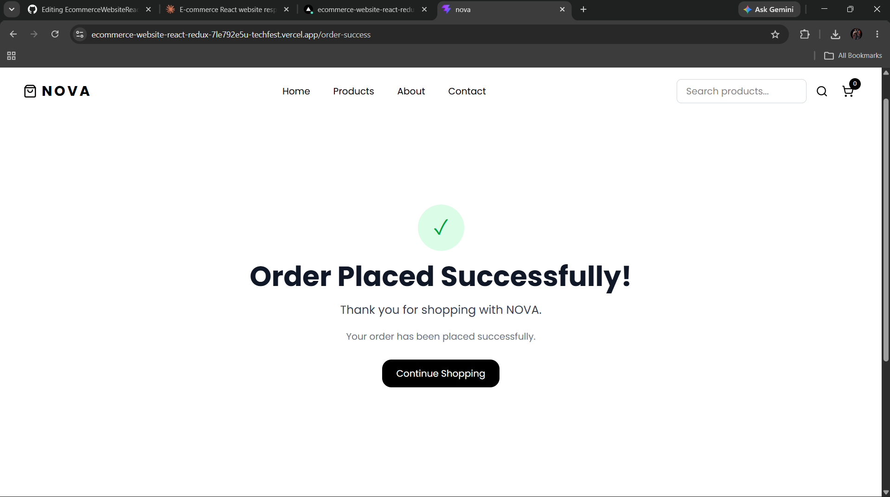
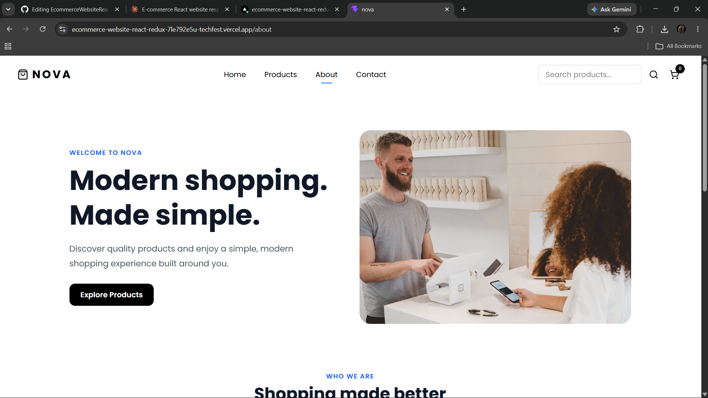
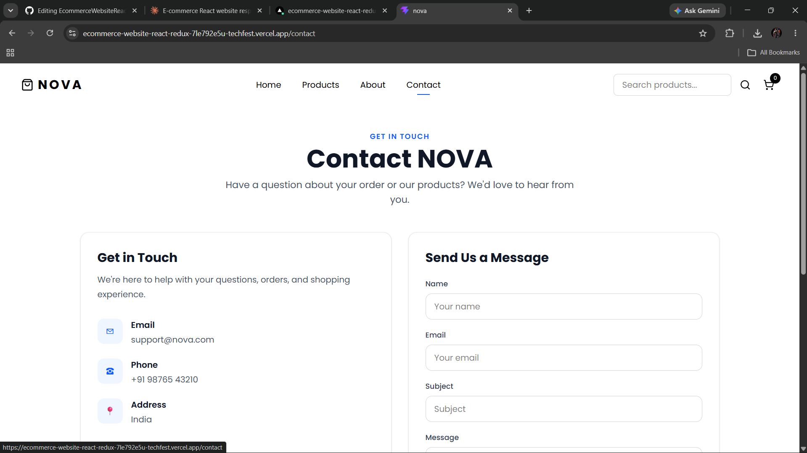

# NOVA — E-Commerce Website

NOVA is a modern, responsive e-commerce website built with React. It includes product browsing, search, product details, a Redux-powered shopping cart, checkout flow, persistent cart data, and responsive UI.

## 🚀 Live Demo

**Live:** [ecommerce-website-react-redux-7le792e5u-techfest.vercel.app](https://ecommerce-website-react-redux-7le792e5u-techfest.vercel.app/)

**GitHub:** Add your GitHub repository URL here

## 📸 Screenshots

### Home Page


### Products Page


### Product Details


### Cart


### Checkout


### Order Success


### About


### Contact


## ✨ Features

* Responsive design for desktop, tablet, and mobile
* Product listing using DummyJSON API
* Product search
* Product details page
* Add products to cart
* Increase and decrease cart quantity
* Remove products from cart
* Cart total and item count
* Empty cart state
* Checkout page
* Order success page
* Persistent cart using browser `localStorage`
* Toast notifications using React Toastify
* Responsive mobile navigation with hamburger menu
* About page
* Contact page
* Footer with navigation and social links

## 🛠️ Tech Stack

* React
* Vite
* React Router
* Redux Toolkit
* Tailwind CSS
* React Toastify
* Lucide React
* React Icons
* DummyJSON API
* Browser Local Storage

## 📂 Project Structure

```text
src/
├── app/
│   └── store.js
│
├── components/
│   ├── Navbar.jsx
│   ├── Hero.jsx
│   ├── Cateogries.jsx
│   ├── FeaturedProducts.jsx
│   ├── NewsLetter.jsx
│   ├── Footer.jsx
│   ├── About.jsx
│   └── Contact.jsx
│
├── features/
│   └── cart/
│       └── cartSlice.js
│
├── pages/
│   ├── Products.jsx
│   ├── ProductDetails.jsx
│   ├── Cart.jsx
│   ├── Checkout.jsx
│   └── OrderSuccess.jsx
│
├── App.jsx
├── main.jsx
└── index.css
```

## ⚙️ Getting Started

Clone the repository:

```bash
git clone YOUR_GITHUB_REPOSITORY_URL
```

Move into the project:

```bash
cd nova
```

Install dependencies:

```bash
npm install
```

Start the development server:

```bash
npm run dev
```

Open the local URL shown by Vite in your browser.

## 📦 Build for Production

Create a production build:

```bash
npm run build
```

Preview the production build locally:

```bash
npm run preview
```

## 🛒 Cart Persistence

NOVA uses `localStorage` to persist cart items between page refreshes.

The cart is stored in the browser and restored when the application starts.

## 🔌 Product API

Products are loaded from the DummyJSON API:

```text
https://dummyjson.com/products
```

## 🎯 Future Improvements

Possible future improvements include:

* User authentication
* Backend API
* Database integration
* Real payment processing
* Order history
* Product filtering and sorting
* Wishlist functionality

## 👨‍💻 Author

**Yash Pacholi**

Built as a React learning and portfolio project.

## 📄 License

This project is created for learning and portfolio purposes.
